Cookie Taste using Cohen’s Kappa
================
Leslie, Oliver, Maya, Maya, Sparsh
2025-04-21

- [Set Up](#set-up)
- [Part 1: Introduction, Questions, and
  Methods](#part-1-introduction-questions-and-methods)
  - [Background](#background)
  - [Guiding Questions](#guiding-questions)
  - [Experiment Design](#experiment-design)
  - [Challenges](#challenges)
- [Part 2: Cookie Size Analysis and Gage
  R&R](#part-2-cookie-size-analysis-and-gage-rr)
  - [Import Data](#import-data)
  - [Initial EDA Checks](#initial-eda-checks)
  - [ANOVA Analysis](#anova-analysis)
    - [Circumference](#circumference)
    - [Height](#height)
    - [Length](#length)
    - [Width](#width)
    - [Weight](#weight)
    - [ANOVA insights](#anova-insights)
  - [**Tukey Honestly Significant
    Difference**](#tukey-honestly-significant-difference)
    - [Insights](#insights)
  - [Graphs](#graphs)
    - [Graph 1](#graph-1)
    - [Graph 2](#graph-2)
    - [Graph 3](#graph-3)
    - [Graph 4](#graph-4)
    - [Graph 5](#graph-5)
- [Part 3: Cookie Taste Analysis](#part-3-cookie-taste-analysis)
  - [Import Data](#import-data-1)
  - [Initial EDA Checks](#initial-eda-checks-1)
  - [Cohen’s Kappa Analysis](#cohens-kappa-analysis)
  - [Kappa](#kappa)
    - [Yumminess - Part 1](#yumminess---part-1)
    - [Flavor](#flavor)
    - [Texture](#texture)
    - [Chocolatey](#chocolatey)
    - [Crispiness](#crispiness)
    - [Chewiness](#chewiness)
    - [Core Team](#core-team)
    - [Yumminess - Part 2](#yumminess---part-2)
    - [Insights](#insights-1)
  - [Graphs](#graphs-1)
    - [Graph 1](#graph-1-1)
    - [Graph 2](#graph-2-1)
    - [Graph 3](#graph-3-1)
    - [Graph 4](#graph-4-1)
    - [Graph 5](#graph-5-1)
    - [Graph 6](#graph-6)
    - [Graph 7](#graph-7)
    - [Graph 8](#graph-8)
- [Part 4: Final Conclusions and Future Exploration
  Tracks](#part-4-final-conclusions-and-future-exploration-tracks)
  - [Quantify Sources of Uncertainty](#quantify-sources-of-uncertainty)
  - [Final Conclusions](#final-conclusions)
  - [Future Work](#future-work)

## Set Up

``` r
library(tidyverse)
```

    ## ── Attaching core tidyverse packages ──────────────────────── tidyverse 2.0.0 ──
    ## ✔ dplyr     1.1.4     ✔ readr     2.1.5
    ## ✔ forcats   1.0.0     ✔ stringr   1.5.1
    ## ✔ ggplot2   3.5.1     ✔ tibble    3.2.1
    ## ✔ lubridate 1.9.4     ✔ tidyr     1.3.1
    ## ✔ purrr     1.0.2     
    ## ── Conflicts ────────────────────────────────────────── tidyverse_conflicts() ──
    ## ✖ dplyr::filter() masks stats::filter()
    ## ✖ dplyr::lag()    masks stats::lag()
    ## ℹ Use the conflicted package (<http://conflicted.r-lib.org/>) to force all conflicts to become errors

``` r
library(modelr)
library(broom)
```

    ## 
    ## Attaching package: 'broom'
    ## 
    ## The following object is masked from 'package:modelr':
    ## 
    ##     bootstrap

``` r
library(irr)
```

    ## Loading required package: lpSolve

# Part 1: Introduction, Questions, and Methods

## Background

Chocolate chip cookies became popularized when a recipe was published by
the Toll House restaurant owner in a 1938 cookbook. They have become an
American dessert staple, being baked in kitchens across the country. 87
years later, we are putting the classic Nestle Toll House recipe to the
test to explore how three key parameters (amount of chocolate,
ingredient quality, and dough temperature) impact variability and
performance of the cookie on a variety of metrics.

## Guiding Questions

We set out to experimentally answer two key questions about chocolate
chip cookies.

1.  What are the characteristics of the ideal cookie? What
    characteristics should we optimize in cookie baking to make the best
    possible cookie from a recipe?
2.  How much variation is there from cookie to cookie within a batch?
    What characteristics account for the most variation from cookie to
    cookie within a batch?

## Experiment Design

To answer these questions, we developed a multipronged experimental
approach geared at understanding the significance of different
parameters we could control in the cookie-baking process. In the
interest of historical accuracy and cultural relevance, we standardized
all of our cookies according to the official [Nestle Toll House cookie
recipe](https://www.verybestbaking.com/toll-house/recipes/original-nestle-toll-house-chocolate-chip-cookies/).
Within this, we identified 3 key parameters which we varied according to
a 2x2x3 full factorial design with 2 replications:

- quality of ingredients (cheap or expensive)
- Temperature of dough (refrigerated or room temperature)
- number of chocolate chips (5, 10, or 15)

Outside of these independent variables, cookies were standardized for
the following control parameters:

- Mass of dough before adding chips (20g +/- 1.5)
- Time in the oven: this was set based on whether the dough was cold or
  room temperature. Cold batches were cooked for 14 minutes (+/-15s)
  with room temp batches cooking for 12 minutes (+/-15s). This time was
  set by toothpick testing a cookie in the center of the first pan
  cooked of each.
- Location on the pan. We recognize that location within the oven can
  often cause differences in temperature and cook time. However, we did
  not feel it would be worthwhile to add one more confounding variable
  to our study in the form of oven temperature uniformity at each
  location. Instead, we marked locations of each cookie (chip count +
  ingredient cost) as shown below and standardized across all pans. We
  also baked the cookies in a convection oven, which should minimize
  temperature variation within the oven via better air circulation.

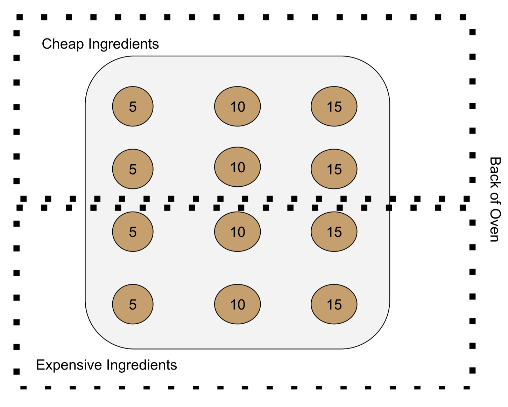

Four total pans of cookies were baked according to the above layout: 2
pans of refrigerated dough and 2 pans of non-refrigerated dough.

We collected data on these cookies in two different areas - analyzing
both size and taste.

**Size:**

For this subset of our analysis, we wanted to investigate the impact of
temperature, ingredient quality, and chip count on the size of cookies
after baking. We measured the following dependent variables to quantify
size.

| Variables | Explanation | Measurement Method |
|----|----|----|
| Length | Top-down diameter at the widest point | Calipers |
| Width | Top-down diameter perpendicular to the widest point | Calipers |
| Height | Distance from the baking tray to the highest point on the cookie | Calipers |
| Circumference | Distance around the perimeter of the cookie | Dental floss around the circumference, compared to the ruler |
| Weight | Weight of cookie after baking and cooling | Kitchen scale |

With the exception of weight, these measurements all rely on human
discretion to identify the widest, tallest, or most circumferential
points on a cookie. To understand this, we had two different individuals
measure the same values on the same cookies so that we could conduct a
Gage R&R and understand the role of measurement error. Only one
measurement was taken for each cookie for weight, as we expect the
digital scale to be more consistent and less variable.

**Taste:**

For this subset of the analysis, we aimed to get an understanding of
what characteristics of a cookie contribute to overall yumminess. We
also wanted to identify whether good cookie texture corresponded more to
chewiness or crispiness. Using the cookies from the previous test, we
asked users to taste each cookie and rate them according to the
following metrics from 1-5, with 1 being the least/worst and 5 being the
most/best:

- Yumminess (personal preference)

- Flavor (personal preference)

- Texture (personal preference)

- Chocolatey-ness (“objective” scale)

- Crispiness (“objective” scale)

- Chewiness (“objective” scale)

For this portion of the experiment, cookies were cut into quarters, so
that each taster could try all 12 cookie configurations. Data was
collected via a Google form to simplify tracking and minimize the risk
of data entry confusion. After this test, we surveyed each taster on
their top 3 favorite cookies, to account for possible changes in taste
after trying so many cookies. This way we could gather additional data
to confirm whether tasters 1-5’s yumminess scales accurately conveyed
their preferences.

## Challenges

We are looking into 3 independent variables and doing multiple
permutations of these variables in the cookies. In total, we are making
12 different kinds of cookies! There are also a ton of dependent
variables we are trying to keep the same. With all these different
pieces and stages, there was a lot of room for variability to occur.
Especially since we were making the cookies from scratch. For example,
the oven is not the same temperature in every spot, and not all
chocolate chips are the same size. Additionally, we have the challenge
that there is a physical limit for how much one person can taste! We had
to quarter the cookies, so the tasters could make it through all 12
variations.

# Part 2: Cookie Size Analysis and Gage R&R

In this section, analysis will be conducted for the data collected on
the physical properties of the cookies as outlined in the background
section.

These variables are height, width, length, circumference, and weight
after baking. We used the Gage R&R method for assessing the variation in
our data measurement and the system itself. We will start by conducting
ANOVA (Analysis of Variance) for each measurement. Then, we will conduct
Tukey’s Honestly Significant Difference test to determine which group
means are significantly different from each other. This will tell us
what factors impact variability in our results the most. We can use this
knowledge to create graphs and analyze our results. Finally, we can
answer our questions.

## Import Data

``` r
filename_cookie <- "./data/results_gage_R_R.csv"
df_cookie <-
  read_csv(
    filename_cookie,
  )
```

    ## Rows: 96 Columns: 11
    ## ── Column specification ────────────────────────────────────────────────────────
    ## Delimiter: ","
    ## chr (3): Fridge, Cheap, Data_taker
    ## dbl (8): Index, Tray, Chocolate_chips, Height, Length, Width, Circumference,...
    ## 
    ## ℹ Use `spec()` to retrieve the full column specification for this data.
    ## ℹ Specify the column types or set `show_col_types = FALSE` to quiet this message.

``` r
df_cookie
```

    ## # A tibble: 96 × 11
    ##    Index  Tray Fridge    Cheap Chocolate_chips Height Length Width Circumference
    ##    <dbl> <dbl> <chr>     <chr>           <dbl>  <dbl>  <dbl> <dbl>         <dbl>
    ##  1     1     1 No fridge Cheap               5   13.8   69.5  63.5          22  
    ##  2     2     1 No fridge Cheap              10   16.0   73.2  68.0          23  
    ##  3     3     1 No fridge Cheap              15   12.9   79.4  65.2          23.5
    ##  4     4     1 No fridge Cheap               5   15.4   74.5  67.2          22.5
    ##  5     5     1 No fridge Cheap              10   14.4   73.1  65.3          22.5
    ##  6     6     1 No fridge Cheap              15   15.2   75.3  65.6          22.5
    ##  7     7     1 No fridge Expe…               5   15.9   57.2  55.6          17.5
    ##  8     8     1 No fridge Expe…              10   17.9   63.8  54.4          18.5
    ##  9     9     1 No fridge Expe…              15   20.0   62.2  55.6          18.5
    ## 10    10     1 No fridge Expe…               5   14.9   62.4  59.5          19  
    ## # ℹ 86 more rows
    ## # ℹ 2 more variables: Weight <dbl>, Data_taker <chr>

We imported the data from the Excel sheet where the researchers logged
their results. This dataset is only the measurement data and variables
for each cookie.

## Initial EDA Checks

``` r
summary(df_cookie)
```

    ##      Index            Tray         Fridge             Cheap          
    ##  Min.   : 1.00   Min.   :1.00   Length:96          Length:96         
    ##  1st Qu.: 3.75   1st Qu.:1.75   Class :character   Class :character  
    ##  Median : 6.50   Median :2.50   Mode  :character   Mode  :character  
    ##  Mean   : 6.50   Mean   :2.50                                        
    ##  3rd Qu.: 9.25   3rd Qu.:3.25                                        
    ##  Max.   :12.00   Max.   :4.00                                        
    ##  Chocolate_chips     Height          Length          Width      
    ##  Min.   : 5      Min.   :11.79   Min.   :57.24   Min.   :49.37  
    ##  1st Qu.: 5      1st Qu.:14.48   1st Qu.:63.41   1st Qu.:57.14  
    ##  Median :10      Median :16.16   Median :67.27   Median :60.91  
    ##  Mean   :10      Mean   :16.12   Mean   :67.54   Mean   :60.77  
    ##  3rd Qu.:15      3rd Qu.:17.75   3rd Qu.:72.21   3rd Qu.:65.25  
    ##  Max.   :15      Max.   :22.07   Max.   :87.91   Max.   :74.95  
    ##  Circumference       Weight       Data_taker       
    ##  Min.   :17.50   Min.   :18.00   Length:96         
    ##  1st Qu.:19.00   1st Qu.:20.00   Class :character  
    ##  Median :20.70   Median :23.00   Mode  :character  
    ##  Mean   :20.66   Mean   :23.69                     
    ##  3rd Qu.:22.00   3rd Qu.:25.80                     
    ##  Max.   :25.50   Max.   :83.09

``` r
head(df_cookie)
```

    ## # A tibble: 6 × 11
    ##   Index  Tray Fridge    Cheap Chocolate_chips Height Length Width Circumference
    ##   <dbl> <dbl> <chr>     <chr>           <dbl>  <dbl>  <dbl> <dbl>         <dbl>
    ## 1     1     1 No fridge Cheap               5   13.8   69.5  63.5          22  
    ## 2     2     1 No fridge Cheap              10   16.0   73.2  68.0          23  
    ## 3     3     1 No fridge Cheap              15   12.9   79.4  65.2          23.5
    ## 4     4     1 No fridge Cheap               5   15.4   74.5  67.2          22.5
    ## 5     5     1 No fridge Cheap              10   14.4   73.1  65.3          22.5
    ## 6     6     1 No fridge Cheap              15   15.2   75.3  65.6          22.5
    ## # ℹ 2 more variables: Weight <dbl>, Data_taker <chr>

We have 11 columns of data: Cookie Index, Tray Number, Fridge, Cheap,
Number of Chocolate Chips, Height, Length, Width, and Circumference. 

All measurements have ranges of results and relatively expected values.
Weight has a Max value that is significantly above any other value and
above the 3rd Quarter value by 55 ozs. This should be investigated.
Other than that, more analysis needs to be done to make conclusions. 

The data is the full population. It is all of the data collected during
the experiment and the source is the team members of this project. We
documented our data-collection procedures. Potential errors in the data
include false measurement (human error), non-homogeneous mixing of the
dough and chocolate chips, cookies falling, or other errors in baking
methods. Missing values could be due to cookies falling on the ground or
an error in data recording.

## ANOVA Analysis

### Circumference

``` r
cookie.cir <- aov(Circumference ~ Index + Tray + Fridge + Cheap + Chocolate_chips + Data_taker, data = df_cookie)

summary(cookie.cir)
```

    ##                 Df Sum Sq Mean Sq F value   Pr(>F)    
    ## Index            1 120.12  120.12  93.618 1.50e-15 ***
    ## Tray             1   3.71    3.71   2.891   0.0925 .  
    ## Fridge           1   0.63    0.63   0.492   0.4851    
    ## Cheap            1  54.78   54.78  42.694 3.88e-09 ***
    ## Chocolate_chips  1   0.20    0.20   0.158   0.6920    
    ## Data_taker       1   0.37    0.37   0.292   0.5901    
    ## Residuals       89 114.20    1.28                     
    ## ---
    ## Signif. codes:  0 '***' 0.001 '**' 0.01 '*' 0.05 '.' 0.1 ' ' 1

``` r
par(mfrow=c(2,2))
plot(cookie.cir)
```

<!-- -->

``` r
par(mfrow=c(1,1))
```

### Height

``` r
cookie.hei <- aov(Height ~ Index + Tray + Fridge + Cheap + Chocolate_chips + Data_taker, data = df_cookie)

summary(cookie.hei)
```

    ##                 Df Sum Sq Mean Sq F value   Pr(>F)    
    ## Index            1 134.36  134.36  55.755 5.32e-11 ***
    ## Tray             1   4.86    4.86   2.017  0.15905    
    ## Fridge           1  22.40   22.40   9.297  0.00302 ** 
    ## Cheap            1   3.36    3.36   1.393  0.24099    
    ## Chocolate_chips  1  93.54   93.54  38.818 1.51e-08 ***
    ## Data_taker       1   8.81    8.81   3.655  0.05910 .  
    ## Residuals       89 214.47    2.41                     
    ## ---
    ## Signif. codes:  0 '***' 0.001 '**' 0.01 '*' 0.05 '.' 0.1 ' ' 1

``` r
par(mfrow=c(2,2))
plot(cookie.hei)
```

<!-- -->

``` r
par(mfrow=c(1,1))
```

### Length

``` r
cookie.len <- aov(Length ~ Index + Tray + Fridge + Cheap + Chocolate_chips + Data_taker, data = df_cookie)

summary(cookie.len)
```

    ##                 Df Sum Sq Mean Sq F value   Pr(>F)    
    ## Index            1 1304.3  1304.3  75.457 1.67e-13 ***
    ## Tray             1   17.9    17.9   1.034    0.312    
    ## Fridge           1    1.7     1.7   0.098    0.755    
    ## Cheap            1  650.0   650.0  37.605 2.33e-08 ***
    ## Chocolate_chips  1    9.7     9.7   0.559    0.457    
    ## Data_taker       1    0.9     0.9   0.054    0.817    
    ## Residuals       89 1538.4    17.3                     
    ## ---
    ## Signif. codes:  0 '***' 0.001 '**' 0.01 '*' 0.05 '.' 0.1 ' ' 1

``` r
par(mfrow=c(2,2))
plot(cookie.len)
```

<!-- -->

``` r
par(mfrow=c(1,1))
```

### Width

``` r
cookie.wid <- aov(Width ~ Index + Tray + Fridge + Cheap + Chocolate_chips + Data_taker, data = df_cookie)

summary(cookie.wid)
```

    ##                 Df Sum Sq Mean Sq F value   Pr(>F)    
    ## Index            1  644.2   644.2  47.432 7.78e-10 ***
    ## Tray             1  202.2   202.2  14.886 0.000216 ***
    ## Fridge           1    2.9     2.9   0.216 0.643558    
    ## Cheap            1  638.9   638.9  47.043 8.86e-10 ***
    ## Chocolate_chips  1   17.0    17.0   1.251 0.266397    
    ## Data_taker       1   14.0    14.0   1.031 0.312609    
    ## Residuals       89 1208.8    13.6                     
    ## ---
    ## Signif. codes:  0 '***' 0.001 '**' 0.01 '*' 0.05 '.' 0.1 ' ' 1

``` r
par(mfrow=c(2,2))
plot(cookie.wid)
```

<!-- -->

``` r
par(mfrow=c(1,1))
```

### Weight

``` r
cookie.wei <- aov(Weight ~ Index + Tray + Fridge + Cheap + Chocolate_chips + Data_taker, data = df_cookie)

summary(cookie.wei)
```

    ##                 Df Sum Sq Mean Sq F value Pr(>F)  
    ## Index            1    235  234.74   5.572 0.0204 *
    ## Tray             1      4    4.01   0.095 0.7583  
    ## Fridge           1     38   38.35   0.910 0.3426  
    ## Cheap            1     76   76.40   1.814 0.1815  
    ## Chocolate_chips  1    105  105.48   2.504 0.1171  
    ## Data_taker       1     44   43.86   1.041 0.3103  
    ## Residuals       89   3749   42.13                 
    ## ---
    ## Signif. codes:  0 '***' 0.001 '**' 0.01 '*' 0.05 '.' 0.1 ' ' 1

``` r
par(mfrow=c(2,2))
plot(cookie.wei)
```

<!-- -->

``` r
par(mfrow=c(1,1))
```

### ANOVA insights

ANOVA was conducted for each measurement type taken. Then we plotted the
results to check for homoscedasticity. Homoscedasticity is where the
variance of the residuals in a regression model is constant across all
levels of the independent variable. If the data is homoscedasticity, the
red line should be centered on zero as it is the mean of the residuals,
and there must be no large outliers that would cause research bias. All
measurement types are centered +/- 1 from 0, with most trending at zero.
The weight measurements have one major outlier, which did offset the
Residuals vs. Leverage graph. From the three other graphs, we can
conclude that there are no major concerns in the data besides this
outlier.

The Q-Q plots regressions of predicted vs actual residuals. If the line
has a slope of 1, it means there is not much deviation, meaning the data
is homoscedastic. All measurement types have slopes close to 1, which
tells us there are no major deviations in the data.

## **Tukey Honestly Significant Difference**

``` r
tukey.cir<-TukeyHSD(cookie.cir)
```

    ## Warning in replications(paste("~", xx), data = mf): non-factors ignored: Index

    ## Warning in replications(paste("~", xx), data = mf): non-factors ignored: Tray

    ## Warning in replications(paste("~", xx), data = mf): non-factors ignored:
    ## Chocolate_chips

    ## Warning in TukeyHSD.aov(cookie.cir): 'which' specified some non-factors which
    ## will be dropped

``` r
tukey.hei<-TukeyHSD(cookie.hei)
```

    ## Warning in replications(paste("~", xx), data = mf): non-factors ignored: Index

    ## Warning in replications(paste("~", xx), data = mf): non-factors ignored: Tray

    ## Warning in replications(paste("~", xx), data = mf): non-factors ignored:
    ## Chocolate_chips

    ## Warning in TukeyHSD.aov(cookie.hei): 'which' specified some non-factors which
    ## will be dropped

``` r
tukey.len<-TukeyHSD(cookie.len)
```

    ## Warning in replications(paste("~", xx), data = mf): non-factors ignored: Index

    ## Warning in replications(paste("~", xx), data = mf): non-factors ignored: Tray

    ## Warning in replications(paste("~", xx), data = mf): non-factors ignored:
    ## Chocolate_chips

    ## Warning in TukeyHSD.aov(cookie.len): 'which' specified some non-factors which
    ## will be dropped

``` r
tukey.wid<-TukeyHSD(cookie.wid)
```

    ## Warning in replications(paste("~", xx), data = mf): non-factors ignored: Index

    ## Warning in replications(paste("~", xx), data = mf): non-factors ignored: Tray

    ## Warning in replications(paste("~", xx), data = mf): non-factors ignored:
    ## Chocolate_chips

    ## Warning in TukeyHSD.aov(cookie.wid): 'which' specified some non-factors which
    ## will be dropped

``` r
tukey.wei<-TukeyHSD(cookie.wei)
```

    ## Warning in replications(paste("~", xx), data = mf): non-factors ignored: Index

    ## Warning in replications(paste("~", xx), data = mf): non-factors ignored: Tray

    ## Warning in replications(paste("~", xx), data = mf): non-factors ignored:
    ## Chocolate_chips

    ## Warning in TukeyHSD.aov(cookie.wei): 'which' specified some non-factors which
    ## will be dropped

``` r
tukey.cir
```

    ##   Tukey multiple comparisons of means
    ##     95% family-wise confidence level
    ## 
    ## Fit: aov(formula = Circumference ~ Index + Tray + Fridge + Cheap + Chocolate_chips + Data_taker, data = df_cookie)
    ## 
    ## $Fridge
    ##                   diff        lwr       upr     p adj
    ## No fridge-Fridge 0.145 -0.3144288 0.6044288 0.5321933
    ## 
    ## $Cheap
    ##                       diff       lwr        upr     p adj
    ## Expensive-Cheap -0.7474359 -1.206865 -0.2880071 0.0017212
    ## 
    ## $Data_taker
    ##                diff        lwr       upr    p adj
    ## Maya M-Leslie 0.125 -0.3344288 0.5844288 0.590126

``` r
tukey.hei
```

    ##   Tukey multiple comparisons of means
    ##     95% family-wise confidence level
    ## 
    ## Fit: aov(formula = Height ~ Index + Tray + Fridge + Cheap + Chocolate_chips + Data_taker, data = df_cookie)
    ## 
    ## $Fridge
    ##                        diff       lwr        upr     p adj
    ## No fridge-Fridge -0.8641667 -1.493781 -0.2345523 0.0076939
    ## 
    ## $Cheap
    ##                      diff        lwr      upr     p adj
    ## Expensive-Cheap 0.1850437 -0.4445706 0.814658 0.5607155
    ## 
    ## $Data_taker
    ##                    diff       lwr      upr     p adj
    ## Maya M-Leslie 0.6058333 -0.023781 1.235448 0.0591024

``` r
tukey.len
```

    ##   Tukey multiple comparisons of means
    ##     95% family-wise confidence level
    ## 
    ## Fit: aov(formula = Length ~ Index + Tray + Fridge + Cheap + Chocolate_chips + Data_taker, data = df_cookie)
    ## 
    ## $Fridge
    ##                       diff      lwr      upr     p adj
    ## No fridge-Fridge 0.2373333 -1.44893 1.923597 0.7803892
    ## 
    ## $Cheap
    ##                      diff      lwr        upr     p adj
    ## Expensive-Cheap -2.574677 -4.26094 -0.8884131 0.0031648
    ## 
    ## $Data_taker
    ##                  diff       lwr      upr     p adj
    ## Maya M-Leslie -0.1975 -1.883763 1.488763 0.8165127

``` r
tukey.wid
```

    ##   Tukey multiple comparisons of means
    ##     95% family-wise confidence level
    ## 
    ## Fit: aov(formula = Width ~ Index + Tray + Fridge + Cheap + Chocolate_chips + Data_taker, data = df_cookie)
    ## 
    ## $Fridge
    ##                        diff       lwr      upr     p adj
    ## No fridge-Fridge -0.3124167 -1.807182 1.182349 0.6789272
    ## 
    ## $Cheap
    ##                      diff      lwr       upr     p adj
    ## Expensive-Cheap -2.552665 -4.04743 -1.057899 0.0010328
    ## 
    ## $Data_taker
    ##                    diff        lwr      upr     p adj
    ## Maya M-Leslie 0.7639583 -0.7308074 2.258724 0.3126094

``` r
tukey.wei
```

    ##   Tukey multiple comparisons of means
    ##     95% family-wise confidence level
    ## 
    ## Fit: aov(formula = Weight ~ Index + Tray + Fridge + Cheap + Chocolate_chips + Data_taker, data = df_cookie)
    ## 
    ## $Fridge
    ##                      diff       lwr      upr     p adj
    ## No fridge-Fridge 1.130583 -1.501937 3.763103 0.3957594
    ## 
    ## $Cheap
    ##                       diff       lwr      upr    p adj
    ## Expensive-Cheap -0.8827025 -3.515222 1.749817 0.506976
    ## 
    ## $Data_taker
    ##                   diff       lwr      upr     p adj
    ## Maya M-Leslie 1.351875 -1.280645 3.984395 0.3103182

### Insights

The Tukey Honest Significant Difference (HSD) test is a post-hoc test
used after performing an ANOVA. It is used to determine which groups are
statistically different from one another. The results of HSD will inform
where the analysis should be conducted. There are over 15 possible pairs
of variables and measurements. This will tell us which pairs to focus
our analysis on. The pairs will be the ones that are the most
statistically different and will most likely provide us with the most
insight. The key pairs the HSD tells us to look at are:

- Circumference vs. Price
- Height vs. Pre-Refrigeration
- Length vs. Price
- Width Vs Price
- Weight Vs Price

An important finding here is that there are no pairs with the variable
“Data_taker” where the p-value is under 0.05. This p-value threshold is
often used in HSD as the cutoff for when a pair is significantly
different. This means that there was no major source of variation in the
results due to the researcher who collected the data. This is important
because it means we can focus on the results themselves being the true
source of variation, not the measurement of the results.

## Graphs

### Graph 1

``` r
df_cookie %>%
  ggplot(aes(x = as.factor(Index), y = Circumference, color = as.factor(Cheap))) +
  geom_point(size = 2, shape = 1, position = position_jitter(width = 0.15, height = 0)) +
  stat_summary(fun.data = mean_se, geom = "errorbar", width = 0.4) +
  stat_summary(fun = mean, geom = "point", size = 3, shape = 18) +
  labs(
    x = "Cookie Index Number",
    y = "Circumference (cm)",
    color = "Cheap or Expensive",
    title = "Cookie Circumference by Index and Price Category"
  ) +
  theme_minimal(base_size = 13) +
  scale_color_manual(values = c("steelblue", "tomato")) +
  theme(
    axis.text.x = element_text(angle = 0, hjust = 0.5),
    plot.title = element_text(face = "bold", hjust = 0.5),
    legend.position = "top"
  )
```

<!-- -->

**Observations:**

Cheap ingredients in cookies tend to lead to a larger cookie
circumference than expensive ingredients. This is seen in the cheap
cookies sit around 22cm, while the expensive cookies sit around 19-20cm.
There is more variation in the expensive cookie circumference,
especially cookies indexed as 12.

### Graph 2

``` r
df_cookie %>%
  ggplot(aes(x = as.factor(Index), y = Height, color = as.factor(Chocolate_chips))) +
  geom_point(size = 2, shape = 1, position = position_jitter(width = 0.15, height = 0)) +
  stat_summary(fun.data = mean_se, geom = "errorbar", width = 0.4) +
  stat_summary(fun = mean, geom = "point", size = 3, shape = 18) +
  labs(
    x = "Cookie Index Number",
    y = "Height (mm)",
    color = "Number of Chocolate Chips",
    title = "Cookie Height by Chocolate Chip Count"
  ) +
  scale_color_viridis_d(option = "C", end = 0.85) +
  theme_minimal(base_size = 13) +
  theme(
    axis.text.x = element_text(angle = 45, hjust = 1),
    legend.position = "top",
    plot.title = element_text(face = "bold", hjust = 0.5)
  )
```

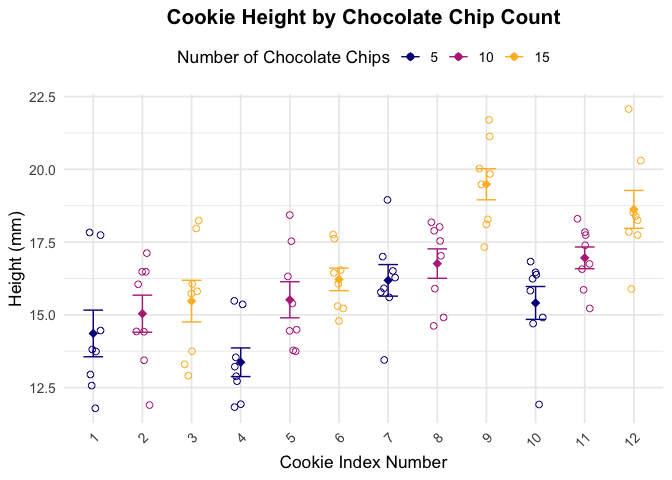<!-- -->

**Observations:**

To understand this graph, one needs to understand the setup of the
cookie index numbers. Each three groups is a group of cookies that are
entirely the same except for the number of cookies. Group 1-3 and 4-6
are repeats of each other, and 7-9 and 10-12 are repeats of each other.
In each trio, the cookie with the most chocolate chips tends to have the
highest height. There is variation in the explicit data points. If you
look at the mean with error bars, you can see the general trends.

### Graph 3

``` r
df_cookie %>%
  ggplot(aes(x = as.factor(Index), y = Length, color = as.factor(Cheap))) +
  geom_point(size = 2, shape = 1, position = position_jitter(width = 0.15, height = 0)) +
  stat_summary(fun.data = mean_se, geom = "errorbar", width = 0.4) +
  stat_summary(fun = mean, geom = "point", size = 3, shape = 18) +
  labs(
    x = "Cookie Index Number",
    y = "Length (mm)",
    color = "Price Category",
    title = "Cookie Length by Price Category"
  ) +
  theme_minimal(base_size = 13) +
  theme(
    axis.text.x = element_text(angle = 45, hjust = 1),
    legend.position = "top",
    plot.title = element_text(face = "bold", hjust = 0.5)
  )
```

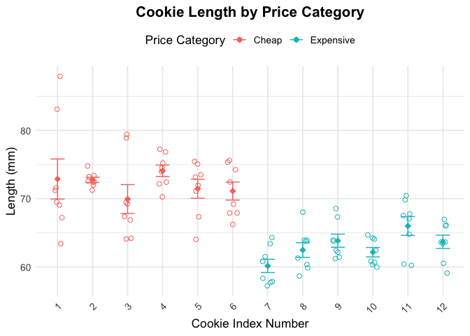<!-- -->

**Observations:**

Cheap ingredients in cookies tend to lead to a longer cookie length than
expensive ingredients. This is seen in the cheap cookies sit around
70-75cm, while the expensive cookies sit around 60-65cm. This is
expected from the results of the circumference data, as a larger length
could suggest a larger circumference.

### Graph 4

``` r
df_cookie %>%
  ggplot(aes(x = as.factor(Index), y = Width, color = as.factor(Cheap))) +
  geom_point(size = 2, shape = 1, position = position_jitter(width = 0.15, height = 0)) +
  stat_summary(fun.data = mean_se, geom = "errorbar", width = 0.4) +
  stat_summary(fun = mean, geom = "point", size = 3, shape = 18) +
  labs(
    x = "Cookie Index Number",
    y = "Width (mm)",
    color = "Price Category",
    title = "Cookie Width by Price Category"
  ) +
  theme_minimal(base_size = 13) +
  scale_color_manual(values = c("#5F9EA0", "#C68642")) +
  theme(
    axis.text.x = element_text(angle = 45, hjust = 1),
    legend.position = "top",
    plot.title = element_text(face = "bold", hjust = 0.5)
  )
```

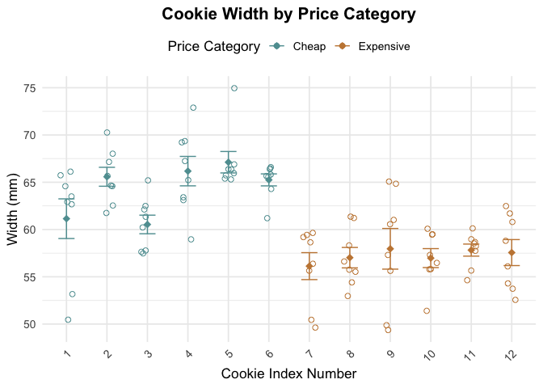<!-- -->

**Observations:**

Cheap ingredients in cookies tend to lead to a larger cookie width than
expensive ingredients. This is seen in the cheap cookies sit around
60-68cm, while the expensive cookies sit around 56-58cm. This is
expected from the results of the circumference data, as a larger width
could suggest a larger circumference. The cheap cookies tend to have
larger lengths and widths, which would lead to a larger circumference.
Further backing up the claim that cheap cookies have a larger
circumference than expensive cookies. The cheap cookies have more
variation in mean width than the expensive cookies.

### Graph 5

``` r
df_cookie %>%
  ggplot(aes(x = as.factor(Index), y = Weight, color = as.factor(Cheap))) +
  geom_point(size = 2, shape = 1, position = position_jitter(width = 0.15, height = 0)) +
  stat_summary(fun.data = mean_se, geom = "errorbar", width = 0.4, color = "black") +
  stat_summary(fun = mean, geom = "point", size = 3, shape = 18, color = "black") +
  labs(
    x = "Cookie Index Number",
    y = "Weight after Baking (grams)",
    color = "Price Category",
    title = "Cookie Weight by Price Category"
  ) +
  scale_color_manual(values = c("#4C6D8C", "#D4A373")) +
  theme_minimal(base_size = 13) +
  theme(
    axis.text.x = element_text(angle = 45, hjust = 1),
    legend.position = "top",
    plot.title = element_text(face = "bold", hjust = 0.5)
  )
```

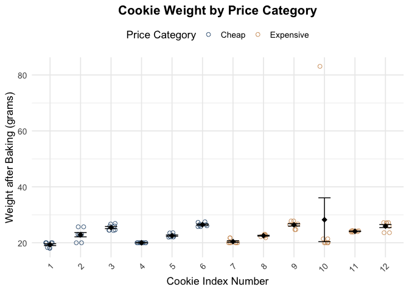<!-- -->

**Observations:**

This graph tries to show how cookie weight is related to the price of
ingredients. From the HSD test above, we know that of our five pairs we
are exploring this pair had the highest p value. Meaning they are less
significantly different. There seems to be a distinct trend between the
first 3 values in each subgroup. These are the subgroups I explained
above. These categories are 5, 10, or 15 chocolate chips (Index 1,2,3,
etc.). As the number of chocolate chips increases, so does the overall
weight, which we assumed would occur as they had the same mass of
batter.

# Part 3: Cookie Taste Analysis

\[TODO - Section Description\]

## Import Data

``` r
filename_cookie_taste <- "./data/Taste_Data.csv"
df_cookie_taste <-
  read_csv(
    filename_cookie_taste,
  )
```

    ## Rows: 6 Columns: 73
    ## ── Column specification ────────────────────────────────────────────────────────
    ## Delimiter: ","
    ## chr  (1): Name
    ## dbl (72): Yumminess/Satisfaction-5CNF, Flavor-5CNF, Texture-5CNF, Chocolatey...
    ## 
    ## ℹ Use `spec()` to retrieve the full column specification for this data.
    ## ℹ Specify the column types or set `show_col_types = FALSE` to quiet this message.

``` r
df_cookie_taste
```

    ## # A tibble: 6 × 73
    ##   Name     `Yumminess/Satisfaction-5CNF` `Flavor-5CNF` `Texture-5CNF`
    ##   <chr>                            <dbl>         <dbl>          <dbl>
    ## 1 Oliver                               2             3              2
    ## 2 Crane                                2             3              2
    ## 3 Maya                                 1             2              1
    ## 4 Sparsh                               2             2              2
    ## 5 Lily Dao                             3             3              2
    ## 6 ZDR                                  2             2              3
    ## # ℹ 69 more variables: `Chocolatey-ness-5CNF` <dbl>, `Crispiness-5CNF` <dbl>,
    ## #   `Chewiness-5CNF` <dbl>, `Yumminess/Satisfaction-10CNF` <dbl>,
    ## #   `Flavor-10CNF` <dbl>, `Texture-10CNF` <dbl>, `Chocolatey-ness-10CNF` <dbl>,
    ## #   `Crispiness-10CNF` <dbl>, `Chewiness-10CNF` <dbl>,
    ## #   `Yumminess/Satisfaction-15CNF` <dbl>, `Flavor-15CNF` <dbl>,
    ## #   `Texture-15CNF` <dbl>, `Chocolatey-ness-15CNF` <dbl>,
    ## #   `Crispiness-15CNF` <dbl>, `Chewiness-15CNF` <dbl>, …

## Initial EDA Checks

``` r
summary(df_cookie_taste)
```

    ##      Name           Yumminess/Satisfaction-5CNF  Flavor-5CNF   Texture-5CNF
    ##  Length:6           Min.   :1                   Min.   :2.0   Min.   :1    
    ##  Class :character   1st Qu.:2                   1st Qu.:2.0   1st Qu.:2    
    ##  Mode  :character   Median :2                   Median :2.5   Median :2    
    ##                     Mean   :2                   Mean   :2.5   Mean   :2    
    ##                     3rd Qu.:2                   3rd Qu.:3.0   3rd Qu.:2    
    ##                     Max.   :3                   Max.   :3.0   Max.   :3    
    ##  Chocolatey-ness-5CNF Crispiness-5CNF Chewiness-5CNF 
    ##  Min.   :1.00         Min.   :3.000   Min.   :2.000  
    ##  1st Qu.:1.25         1st Qu.:3.250   1st Qu.:2.250  
    ##  Median :2.00         Median :4.000   Median :3.500  
    ##  Mean   :2.00         Mean   :3.833   Mean   :3.167  
    ##  3rd Qu.:2.75         3rd Qu.:4.000   3rd Qu.:4.000  
    ##  Max.   :3.00         Max.   :5.000   Max.   :4.000  
    ##  Yumminess/Satisfaction-10CNF  Flavor-10CNF  Texture-10CNF 
    ##  Min.   :2.0                  Min.   :1.00   Min.   :1.00  
    ##  1st Qu.:2.0                  1st Qu.:2.25   1st Qu.:1.25  
    ##  Median :2.5                  Median :3.00   Median :2.00  
    ##  Mean   :2.5                  Mean   :2.50   Mean   :2.00  
    ##  3rd Qu.:3.0                  3rd Qu.:3.00   3rd Qu.:2.75  
    ##  Max.   :3.0                  Max.   :3.00   Max.   :3.00  
    ##  Chocolatey-ness-10CNF Crispiness-10CNF Chewiness-10CNF
    ##  Min.   :2.000         Min.   :2.00     Min.   :2.0    
    ##  1st Qu.:2.250         1st Qu.:2.25     1st Qu.:3.0    
    ##  Median :3.000         Median :3.00     Median :3.0    
    ##  Mean   :2.833         Mean   :3.00     Mean   :3.5    
    ##  3rd Qu.:3.000         3rd Qu.:3.75     3rd Qu.:4.5    
    ##  Max.   :4.000         Max.   :4.00     Max.   :5.0    
    ##  Yumminess/Satisfaction-15CNF  Flavor-15CNF  Texture-15CNF
    ##  Min.   :2.000                Min.   :2.00   Min.   :2    
    ##  1st Qu.:2.250                1st Qu.:2.25   1st Qu.:3    
    ##  Median :3.000                Median :3.00   Median :3    
    ##  Mean   :2.833                Mean   :3.00   Mean   :3    
    ##  3rd Qu.:3.000                3rd Qu.:3.75   3rd Qu.:3    
    ##  Max.   :4.000                Max.   :4.00   Max.   :4    
    ##  Chocolatey-ness-15CNF Crispiness-15CNF Chewiness-15CNF
    ##  Min.   :3.000         Min.   :2.00     Min.   :4.000  
    ##  1st Qu.:4.000         1st Qu.:2.25     1st Qu.:4.000  
    ##  Median :4.000         Median :3.00     Median :4.000  
    ##  Mean   :4.167         Mean   :3.00     Mean   :4.167  
    ##  3rd Qu.:4.750         3rd Qu.:3.75     3rd Qu.:4.000  
    ##  Max.   :5.000         Max.   :4.00     Max.   :5.000  
    ##  Yumminess/Satisfaction-5CF   Flavor-5CF  Texture-5CF  Chocolatey-ness-5CF
    ##  Min.   :2.000              Min.   :2    Min.   :3.0   Min.   :1.0        
    ##  1st Qu.:2.000              1st Qu.:3    1st Qu.:3.0   1st Qu.:1.0        
    ##  Median :2.500              Median :3    Median :3.5   Median :1.5        
    ##  Mean   :2.667              Mean   :3    Mean   :3.5   Mean   :1.5        
    ##  3rd Qu.:3.000              3rd Qu.:3    3rd Qu.:4.0   3rd Qu.:2.0        
    ##  Max.   :4.000              Max.   :4    Max.   :4.0   Max.   :2.0        
    ##  Crispiness-5CF Chewiness-5CF   Yumminess/Satisfaction-10CF  Flavor-10CF
    ##  Min.   :1.0    Min.   :2.000   Min.   :3.000               Min.   :3   
    ##  1st Qu.:2.0    1st Qu.:3.000   1st Qu.:3.000               1st Qu.:3   
    ##  Median :2.5    Median :3.500   Median :3.000               Median :3   
    ##  Mean   :2.5    Mean   :3.333   Mean   :3.167               Mean   :3   
    ##  3rd Qu.:3.0    3rd Qu.:4.000   3rd Qu.:3.000               3rd Qu.:3   
    ##  Max.   :4.0    Max.   :4.000   Max.   :4.000               Max.   :3   
    ##   Texture-10CF   Chocolatey-ness-10CF Crispiness-10CF Chewiness-10CF 
    ##  Min.   :2.000   Min.   :2.000        Min.   :2.000   Min.   :3.000  
    ##  1st Qu.:3.000   1st Qu.:2.250        1st Qu.:2.250   1st Qu.:4.000  
    ##  Median :3.500   Median :3.000        Median :3.000   Median :4.000  
    ##  Mean   :3.333   Mean   :2.833        Mean   :2.833   Mean   :3.833  
    ##  3rd Qu.:4.000   3rd Qu.:3.000        3rd Qu.:3.000   3rd Qu.:4.000  
    ##  Max.   :4.000   Max.   :4.000        Max.   :4.000   Max.   :4.000  
    ##  Yumminess/Satisfaction-15CF  Flavor-15CF     Texture-15CF 
    ##  Min.   :2.00                Min.   :1.000   Min.   :2.00  
    ##  1st Qu.:2.25                1st Qu.:2.250   1st Qu.:2.25  
    ##  Median :3.00                Median :3.000   Median :3.00  
    ##  Mean   :3.00                Mean   :2.667   Mean   :3.00  
    ##  3rd Qu.:3.75                3rd Qu.:3.000   3rd Qu.:3.00  
    ##  Max.   :4.00                Max.   :4.000   Max.   :5.00  
    ##  Chocolatey-ness-15CF Crispiness-15CF Chewiness-15CF Yumminess/Satisfaction-5EF
    ##  Min.   :2.00         Min.   :1.000   Min.   :3.00   Min.   :2.00              
    ##  1st Qu.:3.25         1st Qu.:1.250   1st Qu.:3.25   1st Qu.:3.25              
    ##  Median :4.50         Median :2.000   Median :4.00   Median :4.00              
    ##  Mean   :4.00         Mean   :2.167   Mean   :4.00   Mean   :3.50              
    ##  3rd Qu.:5.00         3rd Qu.:2.750   3rd Qu.:4.75   3rd Qu.:4.00              
    ##  Max.   :5.00         Max.   :4.000   Max.   :5.00   Max.   :4.00              
    ##    Flavor-5EF     Texture-5EF   Chocolatey-ness-5EF Crispiness-5EF 
    ##  Min.   :2.000   Min.   :3.00   Min.   :1.00        Min.   :2.000  
    ##  1st Qu.:3.250   1st Qu.:3.25   1st Qu.:1.25        1st Qu.:2.000  
    ##  Median :4.000   Median :4.00   Median :2.00        Median :2.000  
    ##  Mean   :3.833   Mean   :4.00   Mean   :2.00        Mean   :2.333  
    ##  3rd Qu.:4.750   3rd Qu.:4.75   3rd Qu.:2.75        3rd Qu.:2.000  
    ##  Max.   :5.000   Max.   :5.00   Max.   :3.00        Max.   :4.000  
    ##  Chewiness-5EF Yumminess/Satisfaction-10EF  Flavor-10EF    Texture-10EF  
    ##  Min.   :2.0   Min.   :2.000               Min.   :2.00   Min.   :3.000  
    ##  1st Qu.:3.0   1st Qu.:4.000               1st Qu.:4.00   1st Qu.:4.000  
    ##  Median :3.5   Median :4.500               Median :4.00   Median :4.500  
    ##  Mean   :3.5   Mean   :4.167               Mean   :4.00   Mean   :4.333  
    ##  3rd Qu.:4.0   3rd Qu.:5.000               3rd Qu.:4.75   3rd Qu.:5.000  
    ##  Max.   :5.0   Max.   :5.000               Max.   :5.00   Max.   :5.000  
    ##  Chocolatey-ness-10EF Crispiness-10EF Chewiness-10EF 
    ##  Min.   :2.000        Min.   :2.000   Min.   :3.000  
    ##  1st Qu.:2.500        1st Qu.:3.000   1st Qu.:3.000  
    ##  Median :4.000        Median :3.000   Median :3.500  
    ##  Mean   :3.667        Mean   :3.167   Mean   :3.833  
    ##  3rd Qu.:4.750        3rd Qu.:3.750   3rd Qu.:4.750  
    ##  Max.   :5.000        Max.   :4.000   Max.   :5.000  
    ##  Yumminess/Satisfaction-15EF  Flavor-15EF   Texture-15EF  Chocolatey-ness-15EF
    ##  Min.   :2.000               Min.   :2.0   Min.   :2.00   Min.   :4.000       
    ##  1st Qu.:3.250               1st Qu.:2.5   1st Qu.:2.25   1st Qu.:5.000       
    ##  Median :4.000               Median :4.0   Median :3.50   Median :5.000       
    ##  Mean   :3.667               Mean   :3.5   Mean   :3.50   Mean   :4.833       
    ##  3rd Qu.:4.000               3rd Qu.:4.0   3rd Qu.:4.75   3rd Qu.:5.000       
    ##  Max.   :5.000               Max.   :5.0   Max.   :5.00   Max.   :5.000       
    ##  Crispiness-15EF Chewiness-15EF  Yumminess/Satisfaction-5ENF  Flavor-5ENF   
    ##  Min.   :1.000   Min.   :2.000   Min.   :1.0                 Min.   :1.000  
    ##  1st Qu.:2.000   1st Qu.:2.500   1st Qu.:2.0                 1st Qu.:3.000  
    ##  Median :2.500   Median :4.000   Median :2.5                 Median :3.500  
    ##  Mean   :2.667   Mean   :3.667   Mean   :2.5                 Mean   :3.333  
    ##  3rd Qu.:3.000   3rd Qu.:4.750   3rd Qu.:3.0                 3rd Qu.:4.000  
    ##  Max.   :5.000   Max.   :5.000   Max.   :4.0                 Max.   :5.000  
    ##   Texture-5ENF   Chocolatey-ness-5ENF Crispiness-5ENF Chewiness-5ENF 
    ##  Min.   :2.000   Min.   :1.000        Min.   :1       Min.   :2.000  
    ##  1st Qu.:2.000   1st Qu.:1.250        1st Qu.:2       1st Qu.:3.250  
    ##  Median :2.000   Median :2.500        Median :3       Median :4.000  
    ##  Mean   :2.667   Mean   :2.167        Mean   :3       Mean   :3.667  
    ##  3rd Qu.:2.750   3rd Qu.:3.000        3rd Qu.:4       3rd Qu.:4.000  
    ##  Max.   :5.000   Max.   :3.000        Max.   :5       Max.   :5.000  
    ##  Yumminess/Satisfaction-10ENF  Flavor-10ENF  Texture-10ENF  
    ##  Min.   :2.000                Min.   :1.00   Min.   :2.000  
    ##  1st Qu.:3.000                1st Qu.:2.25   1st Qu.:2.000  
    ##  Median :3.000                Median :3.50   Median :2.500  
    ##  Mean   :3.167                Mean   :3.00   Mean   :3.167  
    ##  3rd Qu.:3.750                3rd Qu.:4.00   3rd Qu.:4.500  
    ##  Max.   :4.000                Max.   :4.00   Max.   :5.000  
    ##  Chocolatey-ness-10ENF Crispiness-10ENF Chewiness-10ENF
    ##  Min.   :2.000         Min.   :1.00     Min.   :3.00   
    ##  1st Qu.:3.250         1st Qu.:2.25     1st Qu.:3.25   
    ##  Median :4.000         Median :3.00     Median :4.00   
    ##  Mean   :3.667         Mean   :3.00     Mean   :4.00   
    ##  3rd Qu.:4.000         3rd Qu.:3.75     3rd Qu.:4.75   
    ##  Max.   :5.000         Max.   :5.00     Max.   :5.00   
    ##  Yumminess/Satisfaction-15ENF  Flavor-15ENF  Texture-15ENF  
    ##  Min.   :4.000                Min.   :3.00   Min.   :3.000  
    ##  1st Qu.:4.250                1st Qu.:3.25   1st Qu.:4.000  
    ##  Median :5.000                Median :4.00   Median :4.500  
    ##  Mean   :4.667                Mean   :4.00   Mean   :4.333  
    ##  3rd Qu.:5.000                3rd Qu.:4.75   3rd Qu.:5.000  
    ##  Max.   :5.000                Max.   :5.00   Max.   :5.000  
    ##  Chocolatey-ness-15ENF Crispiness-15ENF Chewiness-15ENF
    ##  Min.   :4.0           Min.   :1.000    Min.   :2.000  
    ##  1st Qu.:4.0           1st Qu.:2.250    1st Qu.:3.250  
    ##  Median :4.5           Median :3.000    Median :4.000  
    ##  Mean   :4.5           Mean   :2.833    Mean   :3.667  
    ##  3rd Qu.:5.0           3rd Qu.:3.000    3rd Qu.:4.000  
    ##  Max.   :5.0           Max.   :5.000    Max.   :5.000

``` r
head(df_cookie_taste)
```

    ## # A tibble: 6 × 73
    ##   Name     `Yumminess/Satisfaction-5CNF` `Flavor-5CNF` `Texture-5CNF`
    ##   <chr>                            <dbl>         <dbl>          <dbl>
    ## 1 Oliver                               2             3              2
    ## 2 Crane                                2             3              2
    ## 3 Maya                                 1             2              1
    ## 4 Sparsh                               2             2              2
    ## 5 Lily Dao                             3             3              2
    ## 6 ZDR                                  2             2              3
    ## # ℹ 69 more variables: `Chocolatey-ness-5CNF` <dbl>, `Crispiness-5CNF` <dbl>,
    ## #   `Chewiness-5CNF` <dbl>, `Yumminess/Satisfaction-10CNF` <dbl>,
    ## #   `Flavor-10CNF` <dbl>, `Texture-10CNF` <dbl>, `Chocolatey-ness-10CNF` <dbl>,
    ## #   `Crispiness-10CNF` <dbl>, `Chewiness-10CNF` <dbl>,
    ## #   `Yumminess/Satisfaction-15CNF` <dbl>, `Flavor-15CNF` <dbl>,
    ## #   `Texture-15CNF` <dbl>, `Chocolatey-ness-15CNF` <dbl>,
    ## #   `Crispiness-15CNF` <dbl>, `Chewiness-15CNF` <dbl>, …

\[TODO - writeup for summary of the dataset\]

## Cohen’s Kappa Analysis

How to interpret Cohen’s Kappa (from Geeks for Geeks):

**Kappa:**

- k=1: Perfect agreement beyond chance.

- k=0: Agreement equal to that expected by chance alone.

- k=−1: Perfect disagreement beyond chance.

**Interpretation of Cohen’s Kappa values**

- Almost Perfect Agreement (0.81 - 1.00):

  - Indicates very high agreement between the raters.

  - Almost all observed agreement is due to actual agreement, with
    minimal disagreement.

- Substantial Agreement (0.61 - 0.80):

  - Represents a strong level of agreement between raters.

  - A significant portion of the observed agreement is beyond what would
    be expected by chance.

- Moderate Agreement (0.41 - 0.60):

  - Suggests a moderate level of agreement.

  - There is agreement, but there is still a notable amount of
    variability that cannot be attributed to agreement alone.

- Fair Agreement (0.21 - 0.40):

  - Indicates a fair level of agreement.

  - Some agreement is present, but it may not be strong, and a
    substantial amount of variability exists.

- Slight Agreement (0.00 - 0.20):

  - Represents a slight level of agreement.

  - The observed agreement is minimal, and most of it could be due to
    chance.

- Poor Agreement (\< 0.00):

  - Signifies poor agreement, meaning the observed agreement is less
    than what would be expected by chance alone.

## Kappa

``` r
df_taste <- df_cookie_taste %>% 
  select(-Name)

df_taste2 <- t(df_taste)

kappam.light(df_taste2)
```

    ##  Light's Kappa for m Raters
    ## 
    ##  Subjects = 72 
    ##    Raters = 6 
    ##     Kappa = 0.0779 
    ## 
    ##         z = 0.418 
    ##   p-value = 0.676

### Yumminess - Part 1

``` r
df_yummy <-
df_taste %>% 
select(starts_with("Yum"))

df_yummy <- t(df_yummy)

kappam.light(df_yummy)
```

    ##  Light's Kappa for m Raters
    ## 
    ##  Subjects = 12 
    ##    Raters = 6 
    ##     Kappa = 0.099 
    ## 
    ##         z = 0.165 
    ##   p-value = 0.869

### Flavor

``` r
df_flavor <-
df_taste %>% 
select(starts_with("Flavor"))

df_flavor <- t(df_flavor)

kappam.light(df_flavor)
```

    ##  Light's Kappa for m Raters
    ## 
    ##  Subjects = 12 
    ##    Raters = 6 
    ##     Kappa = 0.0948 
    ## 
    ##         z = 0.159 
    ##   p-value = 0.874

### Texture

``` r
df_texture <-
df_taste %>% 
select(starts_with("Text"))

df_texture <- t(df_texture)

kappam.light(df_texture)
```

    ##  Light's Kappa for m Raters
    ## 
    ##  Subjects = 12 
    ##    Raters = 6 
    ##     Kappa = 0.103 
    ## 
    ##         z = 0.282 
    ##   p-value = 0.778

### Chocolatey

``` r
df_chocolatey <-
df_taste %>% 
select(starts_with("Chocolatey"))

df_chocolatey <- t(df_chocolatey)

kappam.light(df_chocolatey)
```

    ##  Light's Kappa for m Raters
    ## 
    ##  Subjects = 12 
    ##    Raters = 6 
    ##     Kappa = 0.131 
    ## 
    ##         z = 0.555 
    ##   p-value = 0.579

### Crispiness

``` r
df_crispiness <-
df_taste %>% 
select(starts_with("Crispiness"))

df_crispiness <- t(df_crispiness)

kappam.light(df_crispiness)
```

    ##  Light's Kappa for m Raters
    ## 
    ##  Subjects = 12 
    ##    Raters = 6 
    ##     Kappa = -0.00668 
    ## 
    ##         z = -0.0149 
    ##   p-value = 0.988

### Chewiness

``` r
df_chewiness <-
df_taste %>% 
select(starts_with("Chewiness"))

df_chewiness <- t(df_chewiness)

kappam.light(df_chewiness)
```

    ##  Light's Kappa for m Raters
    ## 
    ##  Subjects = 12 
    ##    Raters = 6 
    ##     Kappa = 0.00832 
    ## 
    ##         z = 0.00898 
    ##   p-value = 0.993

### Core Team

``` r
df_core <-
df_cookie_taste %>% 
  filter(Name == "Oliver" | Name == "Crane" | Name == "Maya" | Name == "Sparsh") %>% 
  select(-Name)

df_core2 <- t(df_core)

kappam.light(df_core2)
```

    ## Warning in sqrt(varkappa): NaNs produced

    ##  Light's Kappa for m Raters
    ## 
    ##  Subjects = 72 
    ##    Raters = 4 
    ##     Kappa = 0.105 
    ## 
    ##         z = NaN 
    ##   p-value = NaN

### Yumminess - Part 2

``` r
df_yummy2 <-
df_core %>% 
select(starts_with("Yum"))

df_yummy2 <- t(df_yummy2)

kappam.light(df_yummy2)
```

    ## Warning in sqrt(varkappa): NaNs produced

    ##  Light's Kappa for m Raters
    ## 
    ##  Subjects = 12 
    ##    Raters = 4 
    ##     Kappa = 0.136 
    ## 
    ##         z = NaN 
    ##   p-value = NaN

### Insights

\[TODO- brief writeup for Kappa analysis\]

## Graphs

### Graph 1

``` r
df_graph <- df_cookie_taste %>% 
  select(Name, starts_with("Yum")) %>% 
  pivot_longer(
    cols = starts_with("Yum"),
    names_to = "Yummy",
    values_to = "n"
  ) %>% 
  mutate(Yummy = fct_reorder(Yummy, n))

ggplot(df_graph, aes(x = Yummy, y = n, color = Name)) +
  geom_jitter(width = 0.15, height = 0, size = 2.5, alpha = 0.8) +
  scale_color_viridis_d(option = "plasma", end = 0.85) +
  labs(
    x = "Condition",
    y = "Yumminess Rating",
    color = "Rater",
    title = "Yumminess Ratings Across Cookie Conditions"
  ) +
  theme_minimal(base_size = 11) +
  theme(
    axis.text.x = element_text(angle = 90, hjust = 0.5),
    panel.grid.major.x = element_blank(),
    panel.grid.minor.x = element_blank(),
    plot.title = element_text(size = 14, face = "bold", hjust = 0.5)
  )
```

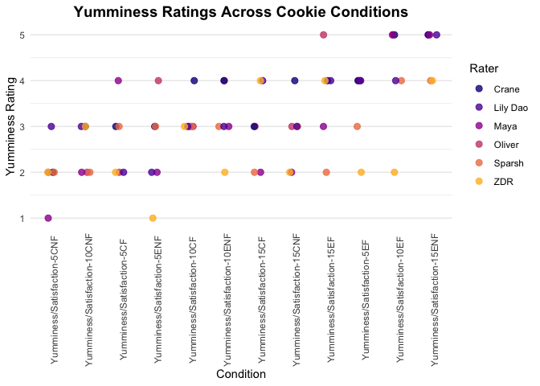<!-- -->

**Observations:**

### Graph 2

``` r
df_graph <- df_graph %>%
  mutate(Yummy = fct_reorder(Yummy, n))

ggplot(df_graph, aes(x = Yummy, y = n)) +
  geom_boxplot(fill = "#69b3a2", color = "#444444", outlier.color = "gray30", outlier.size = 1.5) +
  labs(
    x = "Cookie Condition",
    y = "Yumminess Rating",
    title = "Distribution of Yumminess Ratings by Condition"
  ) +
  theme_minimal(base_size = 11) +
  theme(
    axis.text.x = element_text(angle = 90, hjust = 0),
    plot.title = element_text(face = "bold", hjust = 0.5),
    panel.grid.major.x = element_blank()
  )
```

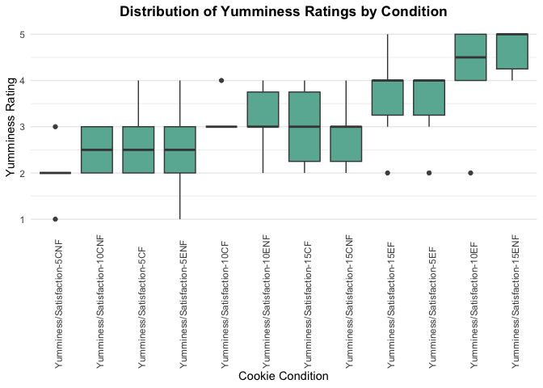<!-- -->

**Observations:**

### Graph 3

``` r
df_expanded <- df_graph %>%
  # Extract the number part, the fridge (yes/no), and cost (expensive/cheap)
  mutate(
    chip_count = as.integer(str_extract(Yummy, "\\d+")), 
    fridge = ifelse(str_detect(Yummy, "NF"), "no", "yes"),  
    cost = ifelse(str_detect(Yummy, "E"), "expensive", "cheap")  
  )

df_expanded %>%
  ggplot(aes(x = fridge, y = n)) + 
  geom_boxplot(fill = "#69b3a2", color = "#444444", outlier.color = "gray30", outlier.size = 1.5) +
  labs(
    x = "Cookie Condition",
    y = "Yumminess Rating",
    title = "Distribution of Yumminess Ratings by Condition"
  ) +
  theme_minimal(base_size = 11) +
  theme(
    axis.text.x = element_text(angle = 90, hjust = 0),
    plot.title = element_text(face = "bold", hjust = 0.5),
    panel.grid.major.x = element_blank()
  )
```

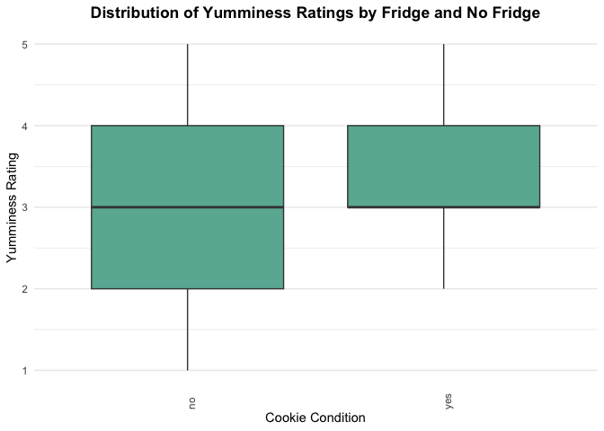<!-- -->

### Graph 4

``` r
df_expanded %>%
  ggplot(aes(x = fridge, y = n, color = Name)) + 
  geom_jitter(width = 0.2, height = 0, size = 2.5, alpha = 0.8) +
  scale_color_brewer(palette = "Set2") +  
  labs(
    x = "Refrigerated",
    y = "Yumminess Rating",
    color = "Name",
    title = "Yumminess Ratings For Fridge or No Fridge"
  ) +
  theme_minimal(base_size = 12) +
  theme(
    plot.title = element_text(face = "bold", hjust = 0.5),
    axis.text.x = element_text(angle = 45, hjust = 1),
    panel.grid.major.x = element_blank(),
    panel.grid.minor = element_blank(),
    legend.position = "top"
  )
```

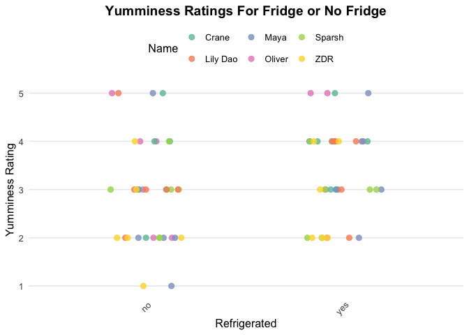<!-- -->

``` r
average_n_by_fridge <- df_expanded %>%
  group_by(fridge) %>%
  summarise(average_n = mean(n, na.rm = TRUE))
print(average_n_by_fridge)
```

    ## # A tibble: 2 × 2
    ##   fridge average_n
    ##   <chr>      <dbl>
    ## 1 no          2.94
    ## 2 yes         3.36

**Observations:**

### Graph 5

``` r
df_expanded %>%
  ggplot(aes(x = factor(chip_count), y = n)) +
  geom_boxplot(fill = "#69b3a2", color = "#444444") +
  labs(
    x = "Cookie Condition",
    y = "Yumminess Rating",
    title = "Distribution of Yumminess Ratings by Condition"
  ) +
  theme_minimal(base_size = 11) +
  theme(
    axis.text.x = element_text(angle = 90, hjust = 0),
    plot.title = element_text(face = "bold", hjust = 0.5),
    panel.grid.major.x = element_blank()
  )
```

<!-- -->

**Observations:**

### Graph 6

``` r
df_expanded %>%
  ggplot(aes(x = chip_count, y = n, color = Name)) + 
  geom_jitter(width = 0.6, height = 0, size = 3, alpha = 0.7, stroke = 0.4) +
  scale_color_brewer(palette = "Dark2") + 
  scale_x_continuous(breaks = c(5, 10, 15)) +
  labs(
    x = "Number of Chocolate Chips",
    y = "Yumminess Rating",
    color = "Name",
    title = "Relationship Between Chip Count and Yumminess"
  ) +
  theme_minimal(base_size = 13) +
  theme(
    plot.title = element_text(face = "bold", hjust = 0.5, size = 14),
    axis.text = element_text(color = "gray20"),
    panel.grid.minor = element_blank(),
    panel.grid.major.x = element_line(color = "gray90"),
    panel.grid.major.y = element_line(color = "gray90"),
    legend.position = "top",
    legend.title = element_text(face = "bold")
  )
```

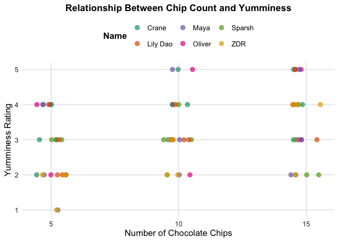<!-- -->

``` r
average_n_by_fridge <- df_expanded %>%
  group_by(chip_count) %>%
  summarise(average_n = mean(n, na.rm = TRUE))
print(average_n_by_fridge)
```

    ## # A tibble: 3 × 2
    ##   chip_count average_n
    ##        <int>     <dbl>
    ## 1          5      2.67
    ## 2         10      3.25
    ## 3         15      3.54

**Observations:**

### Graph 7

``` r
df_expanded %>%
  ggplot(aes(x = cost, y = n)) + 
  geom_boxplot(fill = "#69b3a2", color = "#444444", outlier.color = "gray30", outlier.size = 1.5) +
  labs(
    x = "Cookie Condition",
    y = "Yumminess Rating",
    title = "Distribution of Yumminess Ratings by Condition"
  ) +
  theme_minimal(base_size = 11) +
  theme(
    axis.text.x = element_text(angle = 90, hjust = 0),
    plot.title = element_text(face = "bold", hjust = 0.5),
    panel.grid.major.x = element_blank()
  )
```

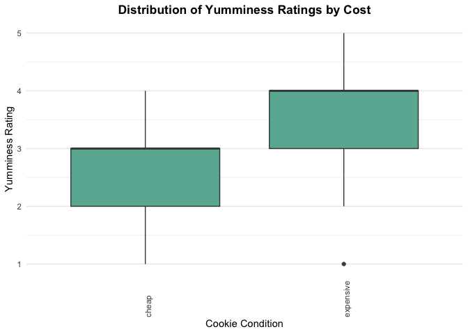<!-- -->

**Observations:**

### Graph 8

``` r
df_expanded %>%
  ggplot(aes(x = cost, y = n, color = Name)) + 
  geom_jitter(width = 0.2, height = 0, size = 3, alpha = 0.7, stroke = 0.4) +
  scale_color_brewer(palette = "Paired") +
  labs(
    x = "Cost of Materials",
    y = "Yumminess Rating",
    color = "Name",
    title = "Relationship Between Cost of Materials and Yumminess"
  ) +
  theme_minimal(base_size = 13) +
  theme(
    plot.title = element_text(face = "bold", hjust = 0.5, size = 14),
    axis.text = element_text(color = "gray20"),
    panel.grid.major.x = element_line(color = "gray90"),
    panel.grid.major.y = element_line(color = "gray90"),
    panel.grid.minor = element_blank(),
    legend.position = "top",
    legend.title = element_text(face = "bold")
  )
```

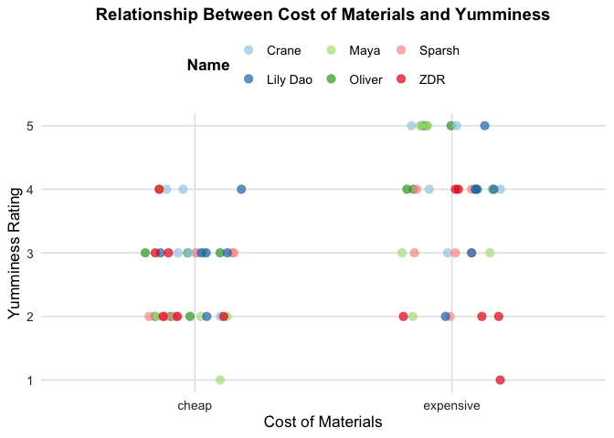<!-- -->

``` r
average_n_by_fridge <- df_expanded %>%
  group_by(cost) %>%
  summarise(average_n = mean(n, na.rm = TRUE))
print(average_n_by_fridge)
```

    ## # A tibble: 2 × 2
    ##   cost      average_n
    ##   <chr>         <dbl>
    ## 1 cheap          2.69
    ## 2 expensive      3.61

**Observations:**

# Part 4: Final Conclusions and Future Exploration Tracks

## Quantify Sources of Uncertainty

\[TODO\]

## Final Conclusions

The results confirm that the price of ingredients (i.e, Cheap Vs
Expensive) causes the most variation in the cookies’ final measurements.
Weight, Circumference, Length, and Width variation is mainly due to the
price of the ingredients. Height’s variation tends to be due to the
number of chocolate chips and pre-baking state (i.e., Refrigerated or
Room Temperature).

An ideal cookie for yumminess depends mainly on the number of chocolate
chips and the cost of ingredients, with very slight preference for
fridge dough. There should be either 10 or 15 chips, with a slight
preference for 10 chips and more expensive ingredients yielded better
results.

## Future Work

There are multiple areas for improvement or exploration, which are as
follows:

- Varying the price of each ingredient to see which ingredient accounts
  for the most variation from cookie to cookie in measurement. Example:
  Using all cheap ingredients except for expensive eggs.

- Effect of baking time on cookie taste, satisfaction, and measurements.
  Cookies become crispier as they bake for longer and are soggier when
  underbaked. The exploration would be in how this affects cookie taste,
  satisfaction, and measurements.

- Larger testing group for cookies. Looking into blind taste tests and
  varying the order of tasting the cookies
